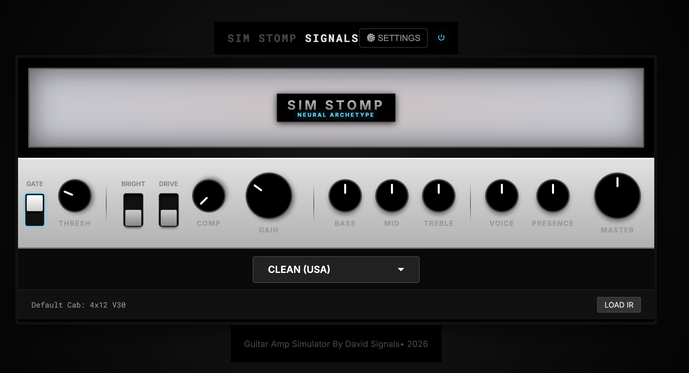
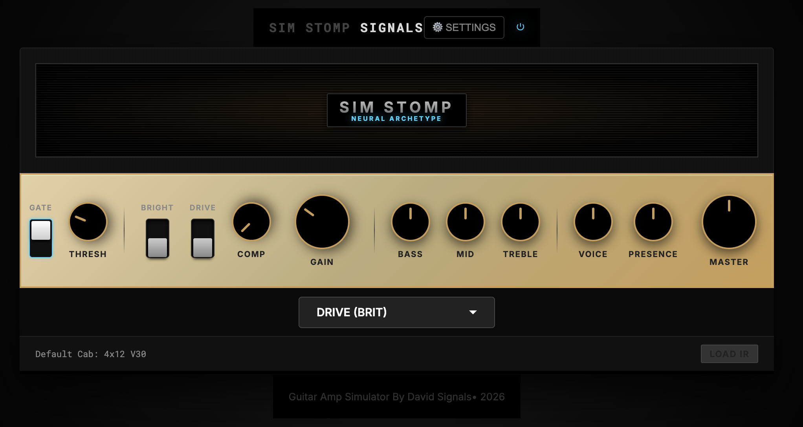
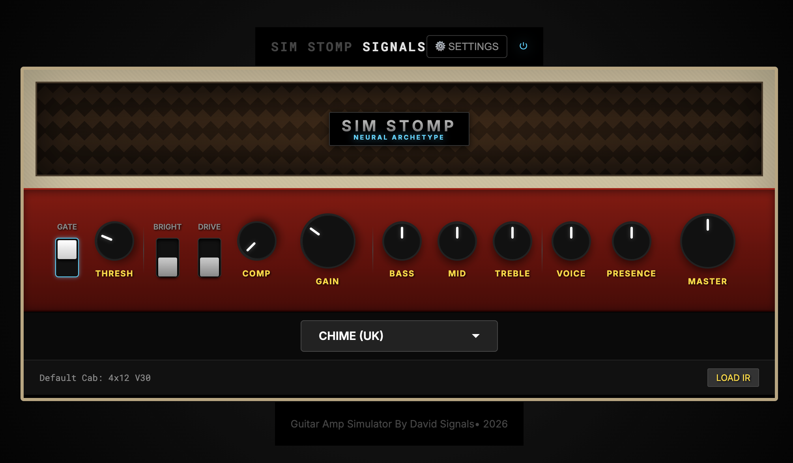

# Sim Stomp Signals

High-Fidelity Neural Amp Simulation running in the browser.

## 📸 Screenshots

### Clean USA

### Drive BRIT

### Chime UK

## Getting Started

Because of how this project is set up, you can now run it directly by opening the `index.html` file in your browser, or dragging it into a browser tab.

### Installation

No installation required.

### Running the App

1.  Locate the folder containing this project.
2.  Double-click `index.html`.
3.  Click "INITIALIZE SYSTEM" to start the audio engine.

## Features

- **Neural Amp Models**: Clean (Fender), Crunch (Vox), Lead (Marshall).
- **Interactive Controls**: Realistic knobs and switches.
- **Audio Engine**: Low-latency web audio processing with cabinet simulation (IRs).
